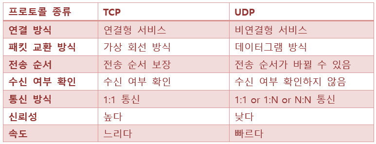

# UDP vs TCP
> https://mangkyu.tistory.com/15

## 간단 정리
> https://ohgyun.com/431
- TCP
  - 커넥션 기반
  - 안정성과 순서를 보장한다
  - 패킷을 자동으로 쪼개준다
  - 적당한 속도로 보내준다. (회선이 처리할 수 있을 만큼)
  - 파일을 쓰는 것처럼 사용하기 쉽다

- UDP
  - 커넥션 기반이 아니다. 직접 구현해야 한다
  - 안정적이지 않고 순서도 보장되지 않는다. 데이터를 잃을 수도, 중복될 수도 있다.
  - 데이터가 크다면, 보낼 때 직접 패킷 단위로 잘라야 한다.
  - 회선이 처리할 수 있을만큼 나눠서 보내야 한다.
  - 패킷을 잃었을 경우, 필요하다면 다양한 방법으로 이를 찾아내서 다시 보내야 한다.

## UDP (User Datagram Protocol)
> 데이터를 데이터그램 단위로 처리하는 비연결형 프로토콜
 
1. 비연결형 프로토콜로 데이터를 전송하기 전에 논리적 연결이 설정되지 않으며 패킷이 독립적으로 전송되는 데이터 그램 방식
   - 보내는 쪽에서 일방적으로 데이터를 전달하는 통신 프로토콜
   - 송신 측에서 전송한 순서와 수신 측에 도착한 순서가 다를 수 있다.

- UDP에는 연결 자체가 없어서(connect 함수 불필요) 서버 소켓과 클라이언트 소켓의 구분이 없다.

- 소켓 대신 IP를 기반으로 데이터를 전송한다.

- 서버와 클라이언트는 1대1, 1대N, N대M 등으로 연결될 수 있다.

- 데이터그램(메세지) 단위로 전송되며 그 크기는 65535바이트로, 크기가 초과하면 잘라서 보낸다.

- 흐름제어(flow control)가 없어서 패킷이 제대로 전송되었는지, 오류가 없는지 확인할 수 없다.

- 파일 전송과 같은 신뢰성이 필요한 서비스보다 성능이 중요시 되는 경우에 사용된다.

## TCP (Transmission Control Protocol)
> 인터넷 상에서 데이터를 메세지의 형태로 보내기 위해 IP와 함께 사용하는 연결형 프로토콜

1. 연결형 서비스로 **데이터를 전송하기 전에 논리적 연결이 설정되는데, 이를 가상회선방식**을 제공한다.
    - [가상회선 vs 데이터 그램](https://woovictory.github.io/2018/12/28/Network-Packet-Switching-Method/)
2. 높은 신뢰성을 보장한다.
3. 3-way handshaking과정을 통해 연결을 설정하고 4-way handshaking을 통해 해제한다.
4. 흐름 제어 및 혼잡 제어.
5. UDP보다 속도가 느리다.
6. 소켓에는 send, receive 버퍼가 존재하여 
7. 전이중(Full-Duplex), 점대점(Point to Point) 방식.

- 패킷단위로 나누어 보내고, 수신측에서 재조립 시행 (패킷 추적)
  - A,,B,C라는 패킷에 1,2,3이라는 번호를 부여하여 패킷의 분실 확인과 같은 처리를 하여 목적지에서 재조립을 합니다. 이런 방식으로 TCP는 패킷을 추적하며, 나누어 보내진 데이터를 받고 조립을 할 수 있습니다.

## Q) 흐름제어(Flow Control)와 혼잡제어(Congestion Control)이란?

- 흐름제어는 데이터를 송신하는 곳과 수신하는 곳의 데이터 처리 속도를 조절하여 수신자의 버퍼 오버플로우를 방지하는 것입니다. 예를 들어 송신하는 곳에서 감당이 안되게 데이터를 빠르게 많이 보내면 수신자에서 문제가 발생하기 때문입니다.

- 혼잡제어는 네트워크 내의 패킷 수가 넘치게 증가하지 않도록 방지하는 것입니다. 만약 정보의 소통량이 과다하면 패킷을 조금만 전송하여 혼잡 붕괴 현상이 일어나는 것을 막습니다.