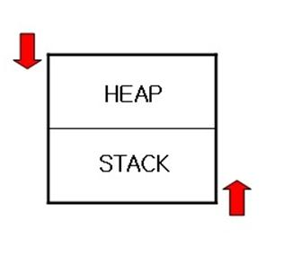

# 프로세스 vs 쓰레드
> [윈도우 시스템 프로그래밍으로 바라본 해당 주제](https://github.com/minkj1992/os/blob/master/window_system_programming/%5BCH11%5D%ED%94%84%EB%A1%9C%EC%84%B8%EC%8A%A4%EC%99%80%20%EC%93%B0%EB%A0%88%EB%93%9C.md)

## 프로세스
- 메인 메모리에서 실행중인 프로그램
- 프로세스 = 가상 메모리 구조(code,data,heap,stack) + 레지스터 set( ARM )

- 가상 메모리 구조
  - 코드 영역(code area): 실행할 프로그램의 기계어 명령이 올라오는 메모리 영역이다. (컴파일 타임)

  - 데이터 영역(data area): static 변수 및 global 변수, 문자열 상수 등 프로그램 실행 시에 정의되고 프로그램이 종료될 때 해제되는 데이터를 저장하는 영역이다. (컴파일 타임)

  - 힙 영역(heap area): 동적 할당한 데이터를 저장하는 영역이다. (런타임)

  - 스택 영역(stack area): 지역 변수 등 임시적으로 사용되는 데이터를 저장하는 영역이다.(런타임)

- STACK & HEAP

  - stack의 지역변수는 사용하고 소멸하므로 데이터 용량의 불확실성을 가지므로 밑에서부터 채워 올리고 heap은 위에서 부터 채워 내려진다. 용량의 불확실성은 컴파일러가 알아서 메모리영역을 선택(랜덤적)

    
  - stack영역에서의 주소값은 시작주소는 밑에서부터(먼저선언된 순서) 그다음 주소는 순서대로 정해진다.
 
- OverFlow
  - HEAP overflow-heap이 위에서부터 주소값을 채워져 내려오다가 stack영역을 침범하는 경우.

  - STACK overflow-stack영역이 heap을 침범.

- `PCB`
  - Process Control Block
  - 하나의 프로세스당 PCB 1개
  - Context Switching이 일어날때마다 2차 저장소에 PCB 형태로 저장

## 쓰레드
- 프로세스의 실행 단위
- Stack과 이 실행의 흐름을 담당하는 PC 레지스터(processor register)를 독립적으로 가지고 있고, PCB를 비롯한 Data, HEAP등은 공유한다.